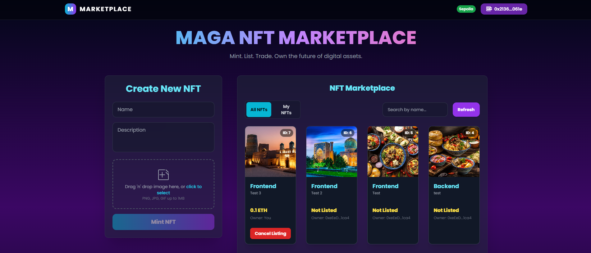

# Maga NFT Marketplace

A full-stack NFT marketplace built with React (Vite + Tailwind), Express backend (Pinata IPFS upload), and Hardhat smart contracts on Ethereum (Sepolia testnet).

  

## Features
- **Mint NFTs**: Upload image, add name/description, mint on Sepolia.
- **Gallery**: View all/my NFTs with search, list/cancel/buy.
- **Web3 Integration**: MetaMask connect, real-time events.
- **IPFS Storage**: Images/metadata pinned via Pinata.
- **Responsive Design**: Works on desktop/mobile.
- **Live Demo**: https://maga-nft-marketplace.netlify.app/

## Tech Stack
- **Frontend**: React, Vite, Tailwind CSS, Ethers.js
- **Backend**: Express.js, Multer (uploads), Axios (Pinata API)
- **Smart Contract**: Solidity, Hardhat, OpenZeppelin (ERC721)
- **Deployment**: Netlify (frontend + functions), Sepolia testnet, Render(backend)

## Setup & Run Locally
1. Clone repo: `git clone https://github.com/Maga-khiva/maga-nft-marketplace`
2. Install deps:
   - Backend: `cd backend && npm install`
   - Frontend: `cd frontend && npm install`
   - Smart contracts: `cd smart-contracts && npm install`
3. Copy env templates:
   - Root reference: `cp .env.example .env` (optional, documentation only)
   - Backend: `cp backend/.env.example backend/.env`
   - Frontend: `cp frontend/.env.example frontend/.env`
   - Smart contracts: `cp smart-contracts/.env.example smart-contracts/.env`
4. Fill required values:
   - `backend/.env`: `PINATA_API_KEY`, `PINATA_API_SECRET`
   - `frontend/.env`: leave `VITE_REQUIRED_CHAIN_ID=31337` for local Hardhat
   - `smart-contracts/.env`: only needed for Sepolia deploy
5. Run local blockchain: `cd smart-contracts && npx hardhat node`
6. Deploy contract to localhost: `cd smart-contracts && npx hardhat run scripts/deploy.js --network localhost`
   - Copy the printed address into `frontend/.env` as `VITE_CONTRACT_ADDRESS=...`
7. Run backend: `cd backend && npm start`
8. Run frontend: `cd frontend && npm start` (or `npm run dev`)
9. Open `http://localhost:5173`, connect MetaMask to `Localhost 8545` (`chainId 31337`), then mint/list/buy.

## Deployment
- **Smart Contract**: Deployed on Sepolia:0xDc85d81583b505D0512410daaB009c5b183e5252
- **Backend**: Render - https://maga-nft-marketplace.onrender.com
- **Frontend**: Netlify Site (Vite build)

## License
MIT — Free to use/fork.

Built by Maga-khiva — Questions? Open an issue!
