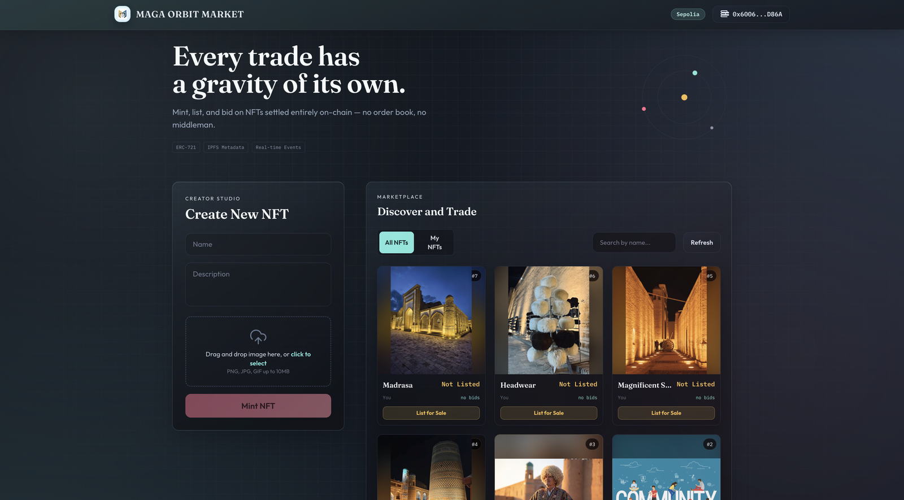

<div align="center">

# 🧊 MAGA Orbit Market

**A full-stack NFT marketplace on Ethereum — mint, list, buy, and bid, all on-chain.**

[](#license)
[](#smart-contract)
[](#testing--security)
[](#live-links)
[](#live-links)

[Live Demo](https://maga-nft-marketplace.netlify.app/) · [Smart Contract](#smart-contract) · [Security Audit Notes](./AUDIT_NOTES.md) · [Report a Bug](https://github.com/Maga-khiva/maga-nft-marketplace/issues)

</div>

---

## Overview

**MAGA Orbit Market** is a complete NFT marketplace dApp: mint an NFT with an image uploaded to IPFS, list it for a fixed price, buy someone else's listing, or place an escrowed on-chain offer and let the owner accept it. Every trading action — listing, buying, bidding, accepting — happens entirely on-chain in a single Solidity contract, with a React frontend and a small Express backend that only handles IPFS pinning.

The project also doubles as a security case study: the contract shipped with a 37-test Hardhat suite and a documented audit that found and fixed a real denial-of-service vulnerability in the bidding flow. See **[AUDIT_NOTES.md](./AUDIT_NOTES.md)** for the full writeup.



---

## Live Links

| | |
|---|---|
| 🌐 Frontend | [maga-nft-marketplace.netlify.app](https://maga-nft-marketplace.netlify.app/) |
| ⚙️ Backend API | [maga-nft-marketplace.onrender.com](https://maga-nft-marketplace.onrender.com) |
| 📄 Contract (Sepolia) | [`0xf30D5f12Bee4fB2781969a29EBf38B89be5B8210`](https://eth-sepolia.blockscout.com/address/0xf30D5f12Bee4fB2781969a29EBf38B89be5B8210#code) |

---

## Design

The UI follows a single visual concept tied to the product's name — **orbit**: trading as gravity, assets moving between owners. Dark-only by design, built around three tokens:

- **Glacier ice** (`#7fe8dd`) — secondary accent, bidding actions
- **Aurora coral** (`#ff6f91`) — the one bold signature color, reserved for the primary action per screen (Mint, Buy Now)
- **Comet gold** (`#f2c14e`) — price emphasis and the "Listed" state

Headlines use **Fraunces** (serif) for a deliberate contrast against the **IBM Plex Sans/Mono** UI — prices, addresses, and token IDs render in monospace for ticker-style alignment, not decoration. The hero features a small orbiting-dots animation as the page's single deliberate motion moment; NFT card state (listed vs. not) is communicated through border color rather than a badge alone.

---

## Features

- 🔌 **Wallet connection** via MetaMask, with auto-reconnect and account-change handling
- 🖼️ **Mint** NFTs with image + metadata uploaded straight to IPFS (Pinata), up to 10MB
- 🔍 **Gallery** with search and "my NFTs" ownership filtering
- 🏷️ **Fixed-price listings** — list, cancel, or buy in one click
- 💰 **Escrowed offers** — place a bid, get auto-refunded if outbid, or have the owner accept your offer
- 🌐 **Resilient IPFS loading** — both metadata and images fall back across three gateways (Pinata → ipfs.io → Cloudflare) if one is slow or unreachable
- 🛡️ **Audited contract** — reentrancy-guarded, CEI-ordered, and hardened against refund-based griefing

---

## Tech Stack

| Layer | Stack |
|---|---|
| Frontend | React, Vite, Tailwind CSS, Ethers.js v6 |
| Backend | Express, Multer, Axios, CORS |
| Smart Contracts | Solidity 0.8.24, Hardhat, OpenZeppelin v5 |
| Storage | IPFS via Pinata |
| Testing | Mocha/Chai, Hardhat Network, custom attacker mocks |
| Hosting | Netlify (frontend), Render (backend) |

---

## Repository Structure

```
.
├── frontend/                    # React dApp
│   └── src/
│       ├── pages/Marketplace.jsx
│       ├── components/          # MintSection, GallerySection, gallery/*
│       └── utils/ipfs.js        # shared IPFS gateway resolution + fallback
├── backend/                     # API for uploads + IPFS pinning
├── smart-contracts/
│   ├── contracts/
│   │   ├── MagaMarketplace.sol  # Core marketplace + NFT contract
│   │   └── mocks/               # Attacker contracts used only in tests
│   │       ├── MaliciousBidder.sol
│   │       └── ReentrantSeller.sol
│   └── test/
│       └── marketplace.test.js  # 37-test Hardhat/Mocha suite
├── AUDIT_NOTES.md                # Security findings & fixes
└── README.md
```

---

## Architecture

A simple 3-layer dApp:

1. **Frontend** (`frontend/`) — React + Ethers.js UI for wallet connection, minting, listings, purchases, and offers.
2. **Backend** (`backend/`) — Express API that accepts uploads and pins NFT media/metadata to IPFS through Pinata.
3. **Smart contract** (`smart-contracts/contracts/MagaMarketplace.sol`) — on-chain ERC-721 marketplace logic for ownership, listing state, and offer escrow.

**Flow:**
1. User uploads NFT data in the frontend.
2. Backend pins files/metadata to IPFS and returns a metadata URI.
3. Frontend calls `mint(tokenURI)` on `MagaMarketplace`.
4. All marketplace actions (`list`, `buy`, `placeOffer`, `cancelOffer`, `acceptOffer`, `withdraw`) execute fully on-chain.

---

## Smart Contract

**Network:** Sepolia (`11155111`)
**Address:** [`0xf30D5f12Bee4fB2781969a29EBf38B89be5B8210`](https://eth-sepolia.blockscout.com/address/0xf30D5f12Bee4fB2781969a29EBf38B89be5B8210#code) — verified on Blockscout & Sourcify

`MagaMarketplace` combines NFT minting and marketplace logic in a single ERC-721 contract:

- **ERC-721 + metadata storage** via OpenZeppelin `ERC721URIStorage`
- **Incremental minting** — `mint(string tokenURI)` and `totalSupply()`
- **Fixed-price listings** — `list(tokenId, price)`, `cancel(tokenId)`, `buy(tokenId)`
- **Seller snapshotting** — `listingSellers[tokenId]` guards against paying a stale/outdated owner
- **Escrowed offers** — `placeOffer`, `cancelOffer`, `acceptOffer`, with automatic refund of the previous highest bidder
- **Pull-payment safety net** — `withdraw()` + `pendingReturns` so a refund that can't be delivered directly never blocks the marketplace (see [Testing & Security](#testing--security))
- **Full event coverage** — `Listed`, `ListingCancelled`, `Bought`, `OfferPlaced`, `OfferCancelled`, `OfferAccepted`, `RefundQueued`, `Withdrawn`

### Security patterns used

- **Reentrancy protection** — `buy`, `placeOffer`, `cancelOffer`, `acceptOffer`, and `withdraw` are all guarded with `nonReentrant`
- **Checks-Effects-Interactions ordering** — state is updated/deleted before any external ETH transfer or NFT transfer
- **Strict authorization checks** — owner-only listing/cancel/accept paths (`ownerOf(tokenId) == msg.sender`)
- **Stale listing prevention** — `buy()` verifies `ownerOf(tokenId) == listingSellers[tokenId]` before transferring or paying
- **Pull over push for cross-user refunds** — `placeOffer()` never lets one bidder's ETH rejection block another bidder's transaction
- **Safe transfer semantics** — uses `_safeTransfer`/`_safeMint` to avoid tokens getting stuck in contracts that can't receive them

---

## Testing & Security

The contract ships with a **37-test Hardhat/Mocha suite** covering every function, every revert path, and two dedicated security investigations:

```
smart-contracts/
├── contracts/mocks/
│   ├── MaliciousBidder.sol   # rejects ETH refunds — proves & then disproves a DoS
│   └── ReentrantSeller.sol   # tries to re-enter buy() from its payment callback
└── test/marketplace.test.js
```

Run it yourself:

```bash
cd smart-contracts
npm test
```

**What the security tests proved:**

| Finding | Severity | Status |
|---|---|---|
| A malicious bidder rejecting ETH could permanently block anyone from outbidding them | High | **Fixed** — pull-payment (`pendingReturns` + `withdraw()`) |
| `buy()` / `acceptOffer()` still push-pay the seller directly | Low | Documented, self-inflicted risk only |
| An active offer survives a direct `buy()` sale, letting the new owner accept it | Informational | Documented as a product decision |
| `ReentrancyGuard` actually blocks re-entry via the payment callback | — | Verified with a PoC attacker contract |

Full writeup, PoCs, and fix rationale: **[AUDIT_NOTES.md](./AUDIT_NOTES.md)**

---

## Local Development

### 1. Clone

```bash
git clone https://github.com/Maga-khiva/maga-nft-marketplace
cd maga-nft-marketplace
```

### 2. Install dependencies

```bash
cd backend && npm install
cd ../frontend && npm install
cd ../smart-contracts && npm install
```

### 3. Create env files

```bash
cp backend/.env.example backend/.env
cp frontend/.env.example frontend/.env
cp smart-contracts/.env.example smart-contracts/.env
```

### 4. Configure env values

**`backend/.env`**
```
PINATA_API_KEY
PINATA_API_SECRET
CORS_ALLOWED_ORIGINS      # include your frontend origin
MAX_UPLOAD_BYTES          # optional, defaults to 10MB
```

**`frontend/.env`**
```
VITE_CONTRACT_ADDRESS       # local or Sepolia address
VITE_API_BASE_URL           # local backend or Render URL
VITE_REQUIRED_CHAIN_ID      # 31337 local, 11155111 Sepolia
```

**`smart-contracts/.env`**
```
SEPOLIA_RPC_URL
DEPLOYER_PRIVATE_KEY
```

### 5. Run locally (Hardhat node)

```bash
# Terminal A
cd smart-contracts
npx hardhat node

# Terminal B
cd smart-contracts
npm run deploy:localhost
npm run export:abi

# Terminal C
cd backend
npm start

# Terminal D
cd frontend
npm run dev
```

Open `http://localhost:5173`, connect MetaMask to the Hardhat local network, then mint/list/buy/bid.

---

## Deploying the Contract to Sepolia

```bash
cd smart-contracts
npm run deploy:sepolia
npm run export:abi
npx hardhat verify --network sepolia <NEW_ADDRESS>
```

After deployment:
1. Update `VITE_CONTRACT_ADDRESS` in `frontend/.env`
2. Update the Netlify env var `VITE_CONTRACT_ADDRESS` (address only, no `KEY=` prefix), then trigger a **clear cache and deploy** — Vite bakes env vars in at build time, so a plain redeploy without cache-clear can still serve the old address
3. Update the contract address in this README

---

## NPM Scripts

<table>
<tr><td valign="top">

**Frontend**
```bash
npm run dev
npm run build
npm run preview
```

</td><td valign="top">

**Backend**
```bash
npm start
npm run dev
```

</td><td valign="top">

**Smart Contracts**
```bash
npm test
npm run deploy:localhost
npm run deploy:sepolia
npm run export:abi
```

</td></tr>
</table>

---

## Troubleshooting

<details>
<summary><code>invalid ENS name ... VITE_CONTRACT_ADDRESS=...</code></summary>

Your env var value is wrong. Set it to only `0x...`, nothing else.
</details>

<details>
<summary>Mint stuck on "Processing…" on the hosted app</summary>

Check `VITE_API_BASE_URL` and the backend's CORS settings. If the Render backend logs show `MulterError: File too large`, the image exceeds `MAX_UPLOAD_BYTES` — either shrink the image or raise the limit.
</details>

<details>
<summary>NFT images don't load / show a broken-image icon</summary>

The frontend tries three IPFS gateways in order (Pinata → ipfs.io → Cloudflare) before giving up — see `frontend/src/utils/ipfs.js`. A single slow gateway on a freshly-pinned file usually resolves itself within a page refresh or two.
</details>

<details>
<summary>Locally minted NFTs not visible on the Netlify site</summary>

Local Hardhat chain data is separate from Sepolia — they're different networks with different state.
</details>

---

## Roadmap

- [ ] Extend pull-payment protection to `buy()` / `acceptOffer()` for full consistency (see Finding 2 in [AUDIT_NOTES.md](./AUDIT_NOTES.md))
- [ ] Optional light theme (currently dark-only by design)

---

## License

MIT

---

<div align="center">

Built by [Maga-khiva](https://github.com/Maga-khiva)

</div>